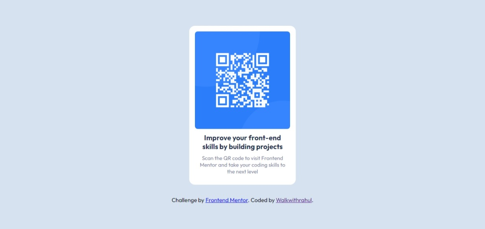

# Frontend Mentor - QR code component solution

This is a solution to the [QR code component challenge on Frontend Mentor](https://www.frontendmentor.io/challenges/qr-code-component-iux_sIO_H). Frontend Mentor challenges help you improve your coding skills by building realistic projects.

### Screenshot

### Links

- Solution URL: [Solution URL here](https://github.com/Walkwithrahul/Qr-code-component.git)
- Live Site URL: [Live site URL here](https://walkwithrahul-qr-component.netlify.app/)

## My process

### Built with

- Semantic HTML5 markup
- CSS custom properties
- Flexbox
- CSS Grid
- Mobile-first workflow

### What I learned

Overall, this project allowed me to apply my HTML5 and CSS3 skills to create a functional and visually appealing web component. It also helped me gain experience in using QR codes, which can be useful in various applications such as mobile marketing and inventory management.

## Author

- Website - [Walkwithrahul](https://walkwithrahul-qr-component.netlify.app/)
- Frontend Mentor - [@walkwithrahul](https://www.frontendmentor.io/profile/walkwithrahul)
- Twitter - [@walkwithrahul](https://www.twitter.com/walkwithrahul)
